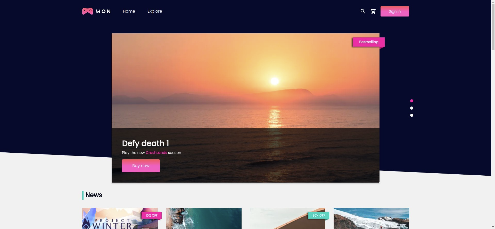
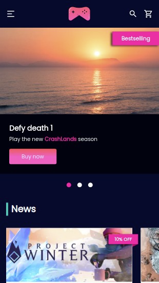

<h1 align="center">
  
</h1>

<h3 align="center">
  Curso realizado com Willian Justen - Edu Souza o/
</h3>

<blockquote align="center">“Nunca é perdido o tempo dedicado ao trabalho - Ralph Waldo Emerson”</blockquote>

<h4 align="center">
  Repositório - React Avançado
</h4>

 

  &nbsp;
  &nbsp;
  

  <a href="#rocket-Sobre-o-curso">Sobre o curso</a>&nbsp; &nbsp; |&nbsp; &nbsp;
  <a href="#-Tecnologias">Tecnologias</a>&nbsp; &nbsp; |&nbsp; &nbsp;
  <a href="#postbox-Entrega">Entrega</a>&nbsp; &nbsp; |&nbsp; &nbsp;
  <a href="#unlock-Licença">Licença</a>

 

## :rocket: Sobre o curso

#### React Avançado

Neste curso estamos criando um e-commerce de jogos, incluindo toda a parte de pagamentos e área do cliente. Os clientes poderão fazer buscas, filtrar, adicionar ao carrinho e comprar seus jogos favoritos.

Temos como backend um CMS completamente customizado ([Strapi](https://strapi.io/)) para que os administradores possam adicionar produtos, categorias, plataformas, criar promoções, editar partes do site, além de emails automatizados para às vendas de cada produto.

#### Screenshots:

   &nbsp; &nbsp;
  

 

##  Tecnologias

Esse projeto está sendo desenvolvido com as seguintes tecnologias:

<table >
  <tr>
    <td align=center><a href="https://nextjs.org/">
NextJs
</a></td>
    <td align=center><a href="https://pt-br.reactjs.org/">
React
</a></td>
    <td align=center><a href="https://nodejs.org/en/">
NodeJs
</a> </td>
    <td align=center><a href="https://www.typescriptlang.org/">
Typescript
</a></td>
    <td align=center><a href="https://styled-components.com/">
S.Comp
</a></td>
    <td align=center><a href="https://storybook.js.org/">
Storybook
</a></td>
    <td align=center><a href="https://jestjs.io/pt-BR/">
&nbsp;Jest&nbsp; 
</a></td>
    <td align=center><a href="https://testing-library.com/">
T.library
</a></td>
    <td align=center><a href="https://eslint.org/">
Eslint
</a></td>
    <td align=center><a href="https://prettier.io/">
Prettier
</a></td>
  </tr>
</table>

 

## :postbox: Entrega

Atualmente estou desenvolvendo esse projeto neste curso, abaixo você segue um preview de como está ficando muito bacana e não esquecendo a regra, todo responsivo :smile:.
Tomei a liberdade, didaticamente falando, de refatorar algumas coisas, ou seja ele não é apenas um copia dos ensinamentos do curso, inclusive o próprio boilerplate. Espero que gostem! :rocket: 
#### Concluído :clipboard:

Acesse o deploy do projeto [aqui](https://edu-souza-landing-page.netlify.app/).

#
## :unlock: Licença

Este projeto está licenciado sob a Licença MIT - consulte [LICENSE](https://opensource.org/licenses/MIT) para maiores detalhes.
